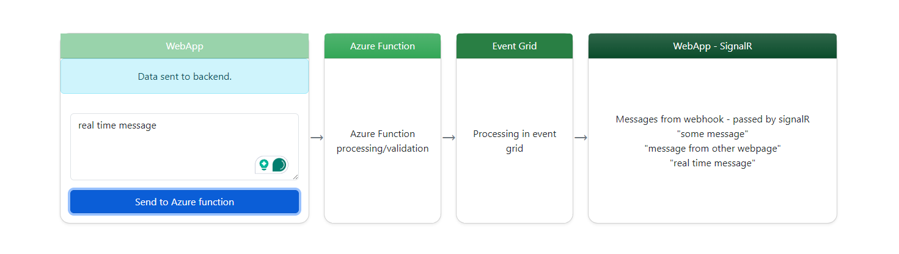

Azure A2C Login with messaging

https://az204messaging-bra4f3fafvhyh0cb.northeurope-01.azurewebsites.net/

## Web App with A2C Login (Google Enabled)
1. Web app with A2C login (google enabled)

---

## Event grid
1. Web app sends messages to azure function
2. Azure function will process the message and pass it to event grid
3. EventGrid uses webhook to send the data back to webapp
4. Webapp uses signalR to send the data to the frontend

---